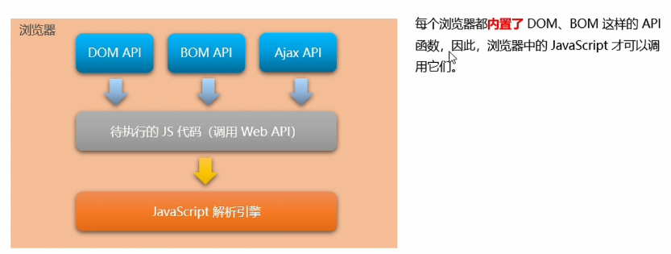
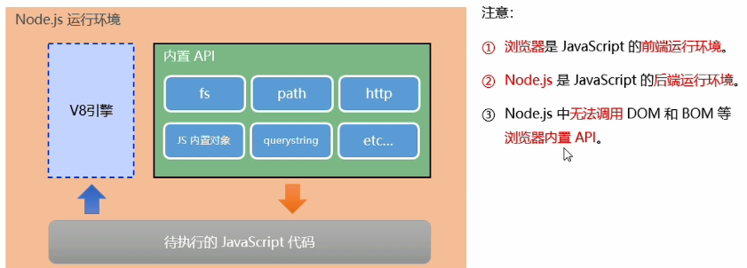

## 1. 初始Node.js 与 内置模块

---

- 为什么 Js 可以在浏览器中被执行？

  > 浏览器中有 **JavaScript 解析引擎**。
  >
  > 不同浏览器有不同的 JS 解析引擎。
  >
  > - Chrome ==> v8
  > - Firefox ==> OdinMonkey
  > - Safri ==> JSCore
  > - IE ==> Chakra

- 为什么 JS 可以操作 DOM 和 BOM？

  

---

### 1.1 什么是Node.js?

> Node.js® is a JavaScript runtime built on [Chrome's V8 JavaScript engine](https://v8.dev/).
>
> Node.js 是一个基于 Chrome V8 引擎的 JavaScript 运行环境。

- Node.js 中的 JavaScript 运行环境：

  

- Node.js 的学习路径：

  JS基础语法 + Node.js 内置 API模块 + 第三方API 模块。

- Node.js 环境安装：

  …

---

### 1.2. fs文件系统模块

- fs.readFile(path[, options], callback),读取文件。

  ~~~ js
  const fs = require('fs');
  
  fs.readFile('./words.txt', 'utf8', function(err, dataStr){
      console.log(err);
      console.log(dataStr);
  })
  ~~~

  

- fs.writeFile(file, data[, options], callback), 写入内容

  只能用来创建文件，不能创建路径。

  ~~~ js
  const fs = require('fs');
  
  fs.writeFile('./wordsTest.txt', "add test me", 'utf-8', function(err){
      console.log(err); // null
  })
  ~~~

  

- 路径动态拼接问题。

  ~~~ js
  fs.readFile(__dirname + '/newScore.txt', 'utf8', function(err, str){
      console.log('__dirname' + str);
  })
  ~~~

---

### 1.3 path路径模块

> 用来处理路径的模块。

- path.join()
- path.basename(), 从路径字符串中，将文件名解析出来。
- path.extname(), 获取路径中的扩展名部分。

### 1.4 http模块

> 在网络节点中，负责消费资源的电脑，叫客户端。
>
> 负责对外提供网络资源的电脑，叫服务器。

> http 模块是Node.js 官方提供的、用来创建 web 服务器的模块。

- http.createServer()

- ==DNS==

- 创建web服务器的基本步骤？

  - 导入http模块。
  - 创建 web 服务器实例。
  - 为服务器实例绑定 request 事件，监听客户端请求。
  - 启动服务器。

  ~~~ js
  const http = require('http')
  const server = http.createServer()
  
  server.on('request', (req, res)=>{
      const url = req.url;
      const method = req.method;
      const str = `your request url is ${url}, method: ${method}`
      res.end(str)
  })
  
  server.listen(8080, function(){
      console.log('server running at http://127.0.0.1:8080');
  })
  ~~~

---

- 解决中文乱码问题。

  ~~~ js
  server.on('request', (req, res)=>{
      const url = req.url;
      const method = req.method;
      const str = `乱码：your request url is ${url}, method: ${method}`
  
      res.setHeader('Content-Type', 'text/html; charset=utf-8')
      res.end(str);
  })
  ~~~

- 根据不同的url 相应不同的 html内容。

  1. 获取 请求的 url 地址。
  2. 设置 默认的响应内容
  3. 判断用户请求的是否为 index.html 
  4. 判断是否为 about.html
  5. 防止乱码
  6. 把内容响应给客户端。

- 优化资源请求路径。

---

### 1.5 模块化

1. Node.js 模块分类：

   - 内置模块
   - 自定义模块
   - 第三方模块

2. 加载模块

   `require()`

3. `Node.js` 中的模块作用域

4. 向外共享模块作用域中的成员 ： `module对象`

   ~~~ json
   Module {
       exports: {},
       parent: Module {
           id: '.',
           exports: {},
           parent: null,
           loaded: false,
   	},
   }
   ~~~

   永远以`module.exports`暴露的为准！

5. 遵循`CommonJS`规范。

---

## 2. npm 与包

### 2.1 包

- 格式化时间： `moment`包

