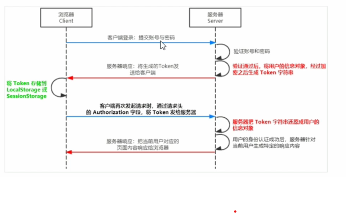

## 1. 初始Node.js 与 内置模块

---

- 为什么 Js 可以在浏览器中被执行？

  > 浏览器中有 **JavaScript 解析引擎**。
  >
  > 不同浏览器有不同的 JS 解析引擎。
  >
  > - Chrome ==> v8
  > - Firefox ==> OdinMonkey
  > - Safri ==> JSCore
  > - IE ==> Chakra

- 为什么 JS 可以操作 DOM 和 BOM？

  

---

### 1.1 什么是Node.js?

> Node.js® is a JavaScript runtime built on [Chrome's V8 JavaScript engine](https://v8.dev/).
>
> Node.js 是一个基于 Chrome V8 引擎的 JavaScript 运行环境。

- Node.js 中的 JavaScript 运行环境：

  

- Node.js 的学习路径：

  JS基础语法 + Node.js 内置 API模块 + 第三方API 模块。

- Node.js 环境安装：

  …

---

### 1.2. fs文件系统模块

- fs.readFile(path[, options], callback),读取文件。

  ~~~ js
  const fs = require('fs');
  
  fs.readFile('./words.txt', 'utf8', function(err, dataStr){
      console.log(err);
      console.log(dataStr);
  })
  ~~~

  

- fs.writeFile(file, data[, options], callback), 写入内容

  只能用来创建文件，不能创建路径。

  ~~~ js
  const fs = require('fs');
  
  fs.writeFile('./wordsTest.txt', "add test me", 'utf-8', function(err){
      console.log(err); // null
  })
  ~~~

  

- 路径动态拼接问题。

  ~~~ js
  fs.readFile(__dirname + '/newScore.txt', 'utf8', function(err, str){
      console.log('__dirname' + str);
  })
  ~~~

---

### 1.3 path路径模块

> 用来处理路径的模块。

- path.join()
- path.basename(), 从路径字符串中，将文件名解析出来。
- path.extname(), 获取路径中的扩展名部分。

### 1.4 http模块

> 在网络节点中，负责消费资源的电脑，叫客户端。
>
> 负责对外提供网络资源的电脑，叫服务器。

> http 模块是Node.js 官方提供的、用来创建 web 服务器的模块。

- http.createServer()

- ==DNS==

- 创建web服务器的基本步骤？

  - 导入http模块。
  - 创建 web 服务器实例。
  - 为服务器实例绑定 request 事件，监听客户端请求。
  - 启动服务器。

  ~~~ js
  const http = require('http')
  const server = http.createServer()
  
  server.on('request', (req, res)=>{
      const url = req.url;
      const method = req.method;
      const str = `your request url is ${url}, method: ${method}`
      res.end(str)
  })
  
  server.listen(8080, function(){
      console.log('server running at http://127.0.0.1:8080');
  })
  ~~~

---

- 解决中文乱码问题。

  ~~~ js
  server.on('request', (req, res)=>{
      const url = req.url;
      const method = req.method;
      const str = `乱码：your request url is ${url}, method: ${method}`
  
      res.setHeader('Content-Type', 'text/html; charset=utf-8')
      res.end(str);
  })
  ~~~

- 根据不同的url 相应不同的 html内容。

  1. 获取 请求的 url 地址。
  2. 设置 默认的响应内容
  3. 判断用户请求的是否为 index.html 
  4. 判断是否为 about.html
  5. 防止乱码
  6. 把内容响应给客户端。

- 优化资源请求路径。

---

### 1.5 模块化

1. Node.js 模块分类：

   - 内置模块
   - 自定义模块
   - 第三方模块

2. 加载模块

   `require()`

3. `Node.js` 中的模块作用域

4. 向外共享模块作用域中的成员 ： `module对象`

   ~~~ json
   Module {
       exports: {},
       parent: Module {
           id: '.',
           exports: {},
           parent: null,
           loaded: false,
   	},
   }
   ~~~

   永远以`module.exports`暴露的为准！

5. 遵循`CommonJS`规范。

---

## 2. npm 与包

### 2.1 包

- 格式化时间： `moment`包
- 安装 `npm install xxxx`
- 语义化版本规范：大版本.功能版本.bug修复版本

---

### 2.2 包管理配置文件

- `package.json`
  - 创建该文件：`npm init -y`

- 卸载包：`npm uninstall xxx`

- devDependencies ： `npm i xxx -D` [只在开发阶段用]

- 下包速度慢：

  - why: 海底光缆
  - 解决：淘宝镜像服务器

  ~~~ shell
  # 查看当前的下包镜像源
  npm config get registry
  # 将下包的镜像源切为淘宝镜像源
  npm config set registry=https://registry.npm.taobao.org/
  # 检查镜像源是否下载成功
  npm config get registry
  ~~~

- `nrm` 快速查看和切换下包的镜像源

  ~~~ shell
  npm i nrm -g
  # 查看所有可用的镜像源
  nrm ls
  # 将所有的镜像源切换为 taobao
  nrm use taobao
  ~~~

- 包的分类：

  - 全局包
  - 项目包
    - 核心依赖包
    - 开发依赖包

- 好包

  - `i5ting_toc` ： md 转化为 html 文件

    ~~~ shell
    i5ting_toc -f xxx -o
    ~~~

---

### 2.3 开发属于自己的包

1. 需要实现功能：
   - 格式化日期
   - 转义 HTML 中的特殊字符
   - 还原 HTML 中的特殊字符
   
2. ……..

3. 发布包

   ~~~ shell
   npm login
   npm publish
   # 删除已经发布的包
   npm unpublish packageName --force
   ~~~

---

### 2.4 模块的加载机制

1. **模块在第一次加载后会被缓存。**
2. 意味着多次调用`require()`不会导致模块的代码被执行多次。
3. 模块优先从缓存中加载。
4. 内置模块优先级最高。

#### 自定义模块加载机制：

test -> test.js -> test.json -> test.node

#### 第三方模块加载机制：

- 从当前模块的父目录开始，尝试从`node_modules`文件夹中加载第三方模块。

- 如果没有找到对应的第三方模块，则移动到再上一层父目录中，进行加载，直到文件系统的根目录。

#### require()引用目录：

- 在被加载的目录下查找 `package.json`文件，并寻找main属性，作为require()加载的入口。
- 如果没有 `package.json` 或者main无法解析，则将index.js进行加载。
- 如果以上两步都失败，error。

---

## 3. express

- nodemon 工具包：监听项目的自动重启 

- 路由

- 模块化路由

  1. 创建路由模块对应的 js 文件
  2. 调用 express.Router() 函数创建路由对象
  3. 向路由对象上挂在具体的路由
  4. 使用 `module.express` 向外共享路由对象
  5. 使用 `app.use()` 函数注册路由模块

- express 中间件。

  - 对请求进行预处理。
  - next()函数。 
  - 全局生效的中间件。

  ---

  - **路由之前注册中间件！**
  - 客户端发送过来的请求，可以连续调用多个中间件函数。
  - 不要忘记调用 `next()` 函数。
  - 为了防止代码逻辑混论，调用`next()`函数后，不要再写额外代码。

- 中间件分类：

  - 应用级别：绑定到app实力上。
  - 路由级别：绑定到`express.Router()` 上。
  - 第三方级别：
  - 内置级别：`express.static()` | `express.json()`  | `express.urlencoded()`
  - **错误级别中间件**： `(err, req, res, next)` ; **注册在路由之后。**

- 自定义中间件：

  1. 定义中间件
  2. 监听req 的 data 事件
  3. 监听 req 的 end 事件
  4. 使用 querystring 模块解析请求体数据
  5. 将解析出来的数据对象挂载为 req.body 

- CORS跨域资源共享

  - 跨域：协议不同
  - 解决：cors | jsonp（只支持get请求）

  ~~~ shell
  npm install cors
  ~~~

  ~~~ shell
  # 允许访问该资源的外域URL
  Access-Control-Allow-Origin
  # 对额外请求头进行声明
  Access-Control-Allow-Headers
  # 声明请求所允许使用的HTTP方法
  Access-Control-Allow-Methods
  ~~~

- 简单请求 | 预检请求

~~~ js
const express = require('express')
const app = express()

// 定义一个简单的中间件函数
const mv = function(req, res, next){
    const time = Date.now();
    req.startTime = time;
    next();
}

// 注册为全局生效的中间件
app.use(mv) 

app.get('/', function (req, res) {  
    res.send('home page' + req.startTime)
    // res.send('home page')
})
app.post('/user', function (req, res) {  
    res.send('user page' + req.startTime)
})

app.listen(8080, ()=>{
    console.log('start succdeed');
})
~~~

---

## 4. 数据库

> 数据库是用来组织、存储和管理数据的仓库。

- 关系型数据库 & 非关系型数据库。

~~~ shell
# 项目中安装 Mysql 模块
npm install mysql
~~~

- 建立连接

  ~~~ js
  const mysql = require('mysql')
  
  // 建立于mysql 数据库的连接
  const db = mysql.createPool({
      host: '127.0.0.1',
      user: 'root',
      password: 'root',
      database: 'heima_nodejs'
  })
  
  // 测试 mysql 模块能否正常工作
  db.query('SELECT 1', (err, res) => {
      if(err) return console.log(err.message);
      console.log(res);
  })
  ~~~

- 查询

  ~~~ js
  // 查询users表中所有数据
  const sqlStr = 'select * from users'
  db.query(sqlStr, (err, res)=>{
      if(err) return console.log(err.message);
      console.log(res);
  })
  ~~~

- 插入

  ~~~ js
  // 插入数据
  const user = {
      username: 'denny',
      password: 'pccse'
  }
  const sqlStr1 = 'INSERT INTO users (username, password) VALUES (?, ?)'
  db.query(sqlStr1, [user.username, user.password], (err, res)=>{
      if(err) return console.log(err.message);
      if(res.affectedRows === 1){
          console.log('插入数据成功');
      }
  })
  
  // 插入数据的便捷方式
  const user1 = {
      username: 'denny',
      password: '9999'
  }
  const sqlStr2 = 'INSERT INTO users SET ?'
  db.query(sqlStr2, user1, (err, res)=>{
      if(err) return console.log(err.message);
      if(res.affectedRows === 1){
          console.log('插入数据成功');
      }
  })
  ~~~

- 更新数据

  ~~~ js
  // 更新数据
  const user2 = {
      username: 'jenny',
      password: '9999'
  }
  const sqlStr3 = 'UPDATE users SET username=? where password=?'
  db.query(sqlStr3, [user2.username, user2.password], (err, res)=>{
      if(err) return console.log(err.message);
      if(res.affectedRows === 2){
          console.log('更新数据成功');
      }
  })
  
  // way2
  db.query(sqlStr3, [user2, user2.password], (err, res)=>{})
  ~~~

- 删除数据

  ~~~ js
  const sqlStr4 = 'DELETE FROM users where password=?'
  db.query(sqlStr4, '9999', (err, res)=>{
      if(err) return console.log(err.message);
      console.log(res);
      if(res.affectedRows === 2){
          console.log('删除数据成功');
      }
  })
  ~~~

- 标记删除

---

## 5. 前后端身份认证

- 服务端渲染：session认证机制
- 前后端分离：JWT 认证机制

#### 5.1 Session认证机制

1. HTTP 协议的无状态性。

   客户端的每次HTTP请求都是独立的，连续多个请求之间没有直接的关系，服务器不会主动保留每次HTTP请求的状态。

2. 如何突破 HTTP 无状态的限制。

   **颁发身份认证标识 —— `Cookie`。**

3. 什么是 Cookie?

   不同域名下的 Cookie 是各自独立的，每当客户端发起请求时，会自动把当前域名下所有未过期的Cookie一同发送到服务器。

4. Cookie 的特性：

   - 自动发送。
   - 域名独立。
   - 过期时限。
   - 4KB 限制。

5. Cookie 在身份认证中的作用：

   客户端第一次请求服务器时，服务器通过响应头的形式，向客户端发送一个身份认证的Cookie，客户端会自动将 Cookie保存在浏览器中。

   随后，当客户端浏览器每次请求服务器时，浏览器会自动将身份认证相关的 Cookie，通过请求头的形式发送给服务器，服务器即可验明客户端的身份。

   

6. **Cookie 不具有安全性**。

7. 提高身份认证的安全性。

   **会员卡 + 刷卡认证 —— Session 认证机制的精髓**

---

8. Session 的工作原理。

   

---

#### 5.2 express 中使用 Session

~~~ js
const express = require('express')
const app = express();

// 1. 导入session中间件
var session = require('express-session')

// 2. 配置Session中间件
app.use(session({
    secret: 'keyword cat',
    resave: false,
    saveUninitialized: true
}))
~~~

---

#### 5.3 JWT 认证机制

> JSON Web Token, 跨域解决方案。

---

1. 组成部分：Header.**PayLoad**.Signature.

2. 使用方式：

   ~~~ shell 
   Authorization: Bearer <token>
   ~~~

3. 安装

   ~~~ shell
   npm install jsonwebtoken express-jwt
   ~~~

## 实战

1. 对密码加密

   ~~~shell
   npm in bcryptjs
   ~~~

2. 优化表单数据验证。

   - @hapi/jpi
   - @escook/express-joi

3. 生成JWT的token字符串

   剔除密码和头像。

   ~~~ shell
   jsonwebtoken
   express-jwt
   ~~~

   
